# งานวิจัย: การใช้งาน Enterprise WiFi Controller ร่วมกับ Captive Portal

**วันที่:** 26 มีนาคม 2569  
**โปรเจกต์:** WiFi Captive Portal  
**สถานะ:** งานวิจัยเบื้องต้น

---

## บทคัดย่อ

เอกสารนี้นำเสนอการวิจัยเกี่ยวกับการบูรณาการ Enterprise WiFi Controller (เช่น Cisco Meraki, Aruba, RUCKUS, Ubiquiti UniFi, Juniper Mist) เข้ากับระบบ Captive Portal ที่พัฒนาด้วย FastAPI ที่มีอยู่ในปัจจุบัน แทนที่จะใช้ Infrastructure แบบดั้งเดิมอย่าง nftables + tc HTB + dnsmasq

---

## 1. บทนำ

### 1.1 ความเป็นมา

ระบบ Captive Portal ปัจจุบันใช้งาน Infrastructure ระดับ Linux ดังนี้:
- **nftables** - สำหรับ firewall rules และ traffic control
- **tc HTB** - สำหรับ bandwidth shaping ต่อ client
- **dnsmasq** - สำหรับ DHCP และ DNS redirect

แนวทางนี้ต้องการการดูแลรักษาระดับ System Administration ที่สูง และมีข้อจำกัดในการ scale

### 1.2 วัตถุประสงค์

- ศึกษาความเป็นไปได้ในการใช้ Enterprise WiFi Controller แทน Linux infrastructure
- เปรียบเทียบผู้ให้บริการ WiFi Controller ชั้นนำ
- ออกแบบสถาปัตยกรรมการบูรณาการที่เหมาะสม
- กำหนดว่าส่วนใดควรเก็บไว้ใน FastAPI และส่วนใดควรย้ายไปยัง WiFi Controller

---

## 2. WiFi Controller คืออะไร?

### 2.1 คำนิยาม

**WiFi Controller** (หรือ WLAN Controller, Wireless Switch) คืออุปกรณ์เครือข่ายที่จัดการ Access Points (APs) หลายตัวจากจุดศูนย์กลางเดียว

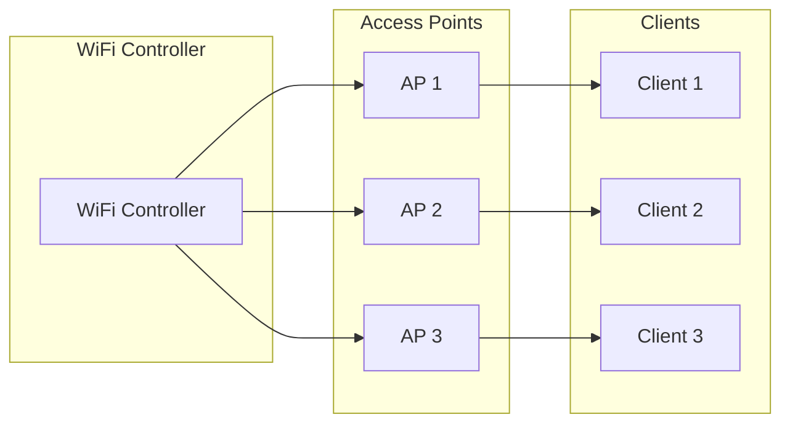

### 2.2 ฟีเจอร์หลักของ WiFi Controller

| ฟีเจอร์ | รายละเอียด |
|---------|------------|
| **AP Management** | ตั้งค่า อัพเดท firmware จากจุดศูนย์กลาง |
| **Client Roaming** | Roaming ระดับ Layer 2/3 ระหว่าง APs |
| **Bandwidth Control** | จำกัด rate limit ต่อ client, QoS |
| **Access Control** | Authentication, authorization, MAC filtering |
| **Captive Portal** | Built-in หรือ integrated splash page redirect |
| **Client Isolation** | ปิดกั้น traffic ระหว่าง clients |
| **Radio Management** | เลือก channel, ปรับ power |

---

## 3. ผู้ให้บริการ Enterprise WiFi Controller ชั้นนำ

### 3.1 Cisco Meraki (Cloud-Managed)

**สถาปัตยกรรม:** Cloud-first ไม่มี on-premise controller

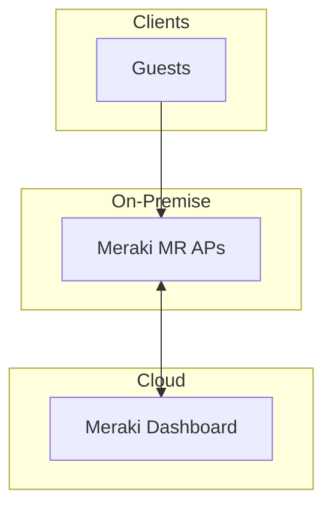

| ฟีเจอร์ | การ impl |
|---------|----------|
| **Captive Portal API** | มี - REST API สำหรับ splash pages แบบกำหนดเอง |
| **Bandwidth Control** | จำกัด rate limit ต่อ client ผ่าน API |
| **Client Isolation** | Built-in ที่ระดับ AP |
| **Authentication** | RADIUS, LDAP, OAuth, SAML |
| **API** | Dashboard REST API (OpenAPI v3) |
| **SDK** | Python, Go, Node.js official SDKs |

**Meraki Captive Portal API Features:**
- Click-through (ยอมรับ TOS แบบง่าย)
- Sign-on (authentication แบบเต็มพร้อม accounting)
- OAuth 2.0 integration กับ Facebook, Google
- SMS OTP support
- Sponsored guest access

**ข้อดี:** ใช้งานง่าย, cloud-managed, API ครบวงจร  
**ข้อเสีย:** ต้องพึ่งพา internet, license รายปี

---

### 3.2 Aruba (HPE Aruba)

**สถาปัตยกรรม:** Traditional WLAN controller + Cloud options (Aruba Central)

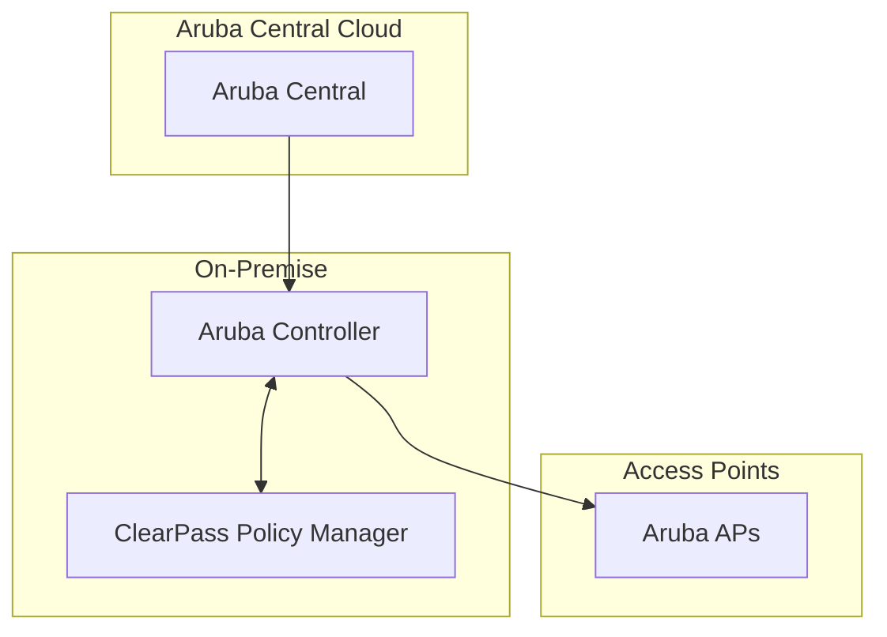

| ฟีเจอร์ | การ impl |
|---------|----------|
| **Captive Portal** | Built-in FAS (Foreign Authentication Server) |
| **Bandwidth Control** | Per-role QoS, traffic shaping |
| **Client Isolation** | Bridge/role-based isolation |
| **Authentication** | ClearPass Policy Manager |
| **API** | REST API for ClearPass + Aruba Central |
| **Protocols** | RADIUS, TACACS+, 802.1X |

**ข้อดี:** Enterprise-grade, ClearPass ทรงพลังมาก  
**ข้อเสีย:** ซับซ้อน, ต้องการ expertise

---

### 3.3 RUCKUS Networks

**สถาปัตยกรรม:** Traditional controller + Unleashed (controller-less) + Cloud (RUCKUS One)

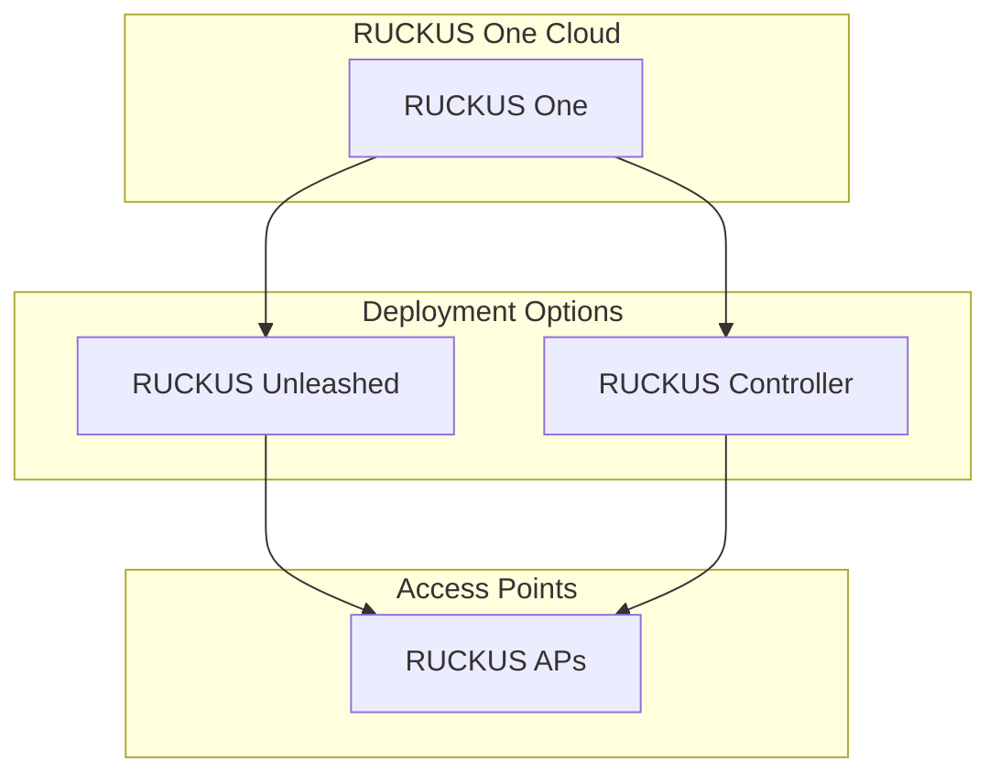

| ฟีเจอร์ | การ impl |
|---------|----------|
| **Captive Portal** | Guest Access พร้อม custom redirect |
| **Bandwidth Control** | SmartCast QoS, per-user limits |
| **Client Isolation** | Dynamic VLAN segmentation |
| **Authentication** | DPSK, 802.1X, RADIUS |
| **API** | REST API via RUCKUS One cloud |

**DPSK (Dynamic Pre-Shared Key):**
- WPA2 password เฉพาะต่อ guest
- ไม่ต้องใช้ shared PSK
- สร้างได้จาก external portal

**ข้อดี:** ราคาถูกกว่าคู่แข่ง, เทคโนโลยี BeamFlex  
**ข้อเสีย:** Cloud features ยังไม่ครบเท่าคู่แข่ง

---

### 3.4 Ubiquiti (UniFi)

**สถาปัตยกรรม:** Controller software (self-hosted) + Cloud option

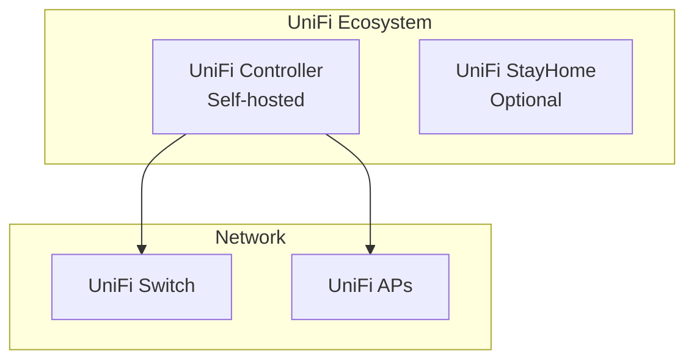

| ฟีเจอร์ | การ impl |
|---------|----------|
| **Captive Portal** | UniFi Portal พร้อม customization |
| **Bandwidth Control** | Per-user bandwidth limits, traffic groups |
| **Client Isolation** | Network isolation ผ่าน VLANs |
| **Authentication** | Local users, RADIUS, vouchers |
| **API** | UniFi Controller REST API |

**ข้อดี:** ราคาถูก, self-hosted ได้, ใช้งานง่าย  
**ข้อเสีย:** Enterprise features จำกัดกว่าคู่แข่งรายใหญ่

---

### 3.5 Juniper (Mist)

**สถาปัตยกรรม:** Cloud-native, AI-driven

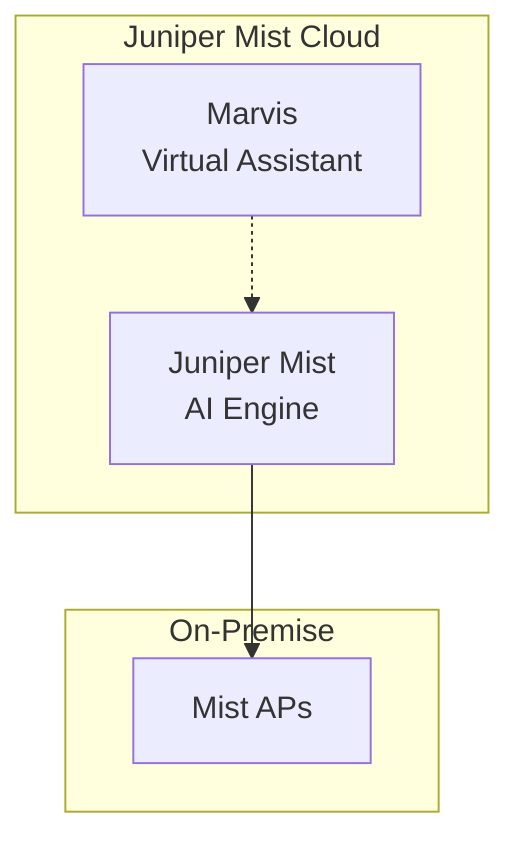

| ฟีเจอร์ | การ impl |
|---------|----------|
| **Captive Portal** | Marvis Virtual Wiring Assistant |
| **Bandwidth Control** | Per-client SLA enforcement |
| **Client Isolation** | Wireless segmentation |
| **API** | Mist API (REST) |
| **SDK** | Python, Node.js มีให้ใช้งาน |

**ข้อดี:** AI-driven, cloud-native, modern architecture  
**ข้อเสีย:** ใหม่ในตลาด, อาจมี bugs

---

## 4. เปรียบเทียบฟีเจอร์

| ฟีเจอร์ | Meraki | Aruba | RUCKUS | UniFi | Mist |
|---------|--------|-------|--------|-------|------|
| **Per-client bandwidth limits** | ✅ API | ✅ ClearPass | ✅ | ✅ API | ✅ |
| **Client isolation** | ✅ | ✅ AirGroup | ✅ | ✅ VLAN | ✅ |
| **Custom captive portal** | ✅ API | ✅ FAS | ✅ | ✅ | ✅ |
| **RADIUS integration** | ✅ | ✅ ClearPass | ✅ | ✅ | ✅ |
| **OAuth/Social login** | ✅ | ✅ | ❌ | ❌ | ✅ |
| **SMS OTP** | ✅ | ✅ | ❌ | ❌ | ✅ |
| **Guest vouchers** | ✅ | ✅ | ✅ | ✅ | ✅ |
| **VLAN assignment** | ✅ | ✅ | ✅ | ✅ | ✅ |
| **Traffic accounting** | ✅ | ✅ | ✅ | ✅ | ✅ |
| **REST API** | ✅ Full | ✅ | ✅ | ✅ | ✅ Full |
| **Cloud-managed** | ✅ | ✅ | ✅ | ✅ | ✅ |
| **Self-hosted option** | ❌ | ✅ | ✅ | ✅ | ❌ |

---

## 5. สถาปัตยกรรมการบูรณาการ

### 5.1 Pattern A: WiFi Controller เป็น Enforcement Point

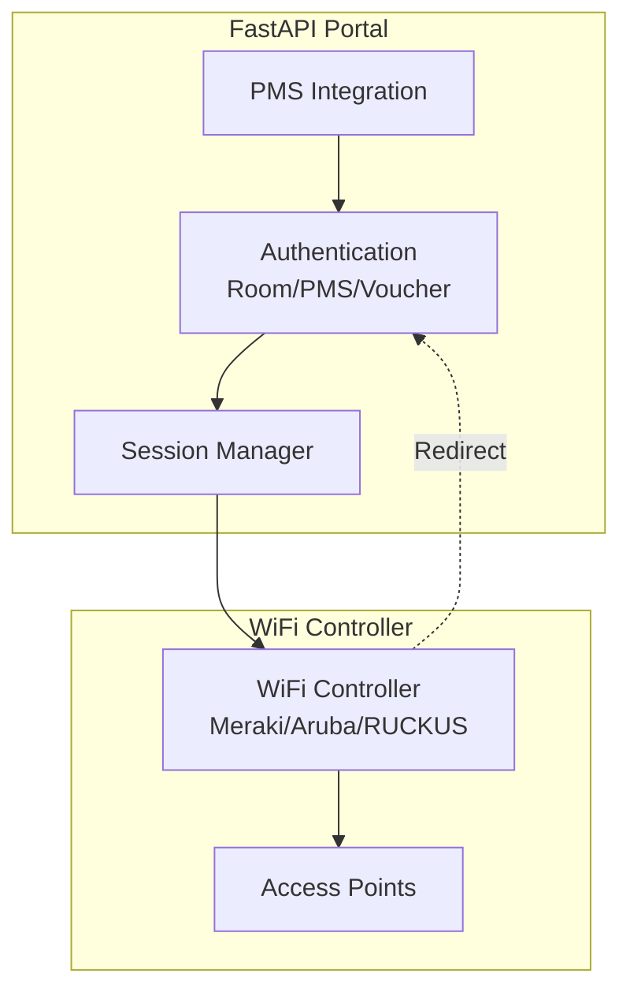

### 5.2 Pattern B: API-Based Integration (Meraki, UniFi, Mist)

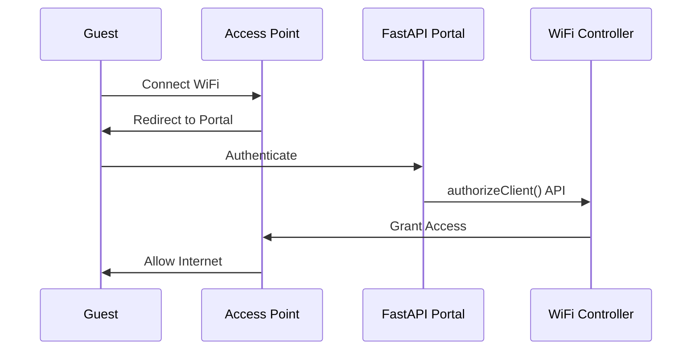

### 5.3 Pattern C: RADIUS-Based Integration (Aruba, RUCKUS)

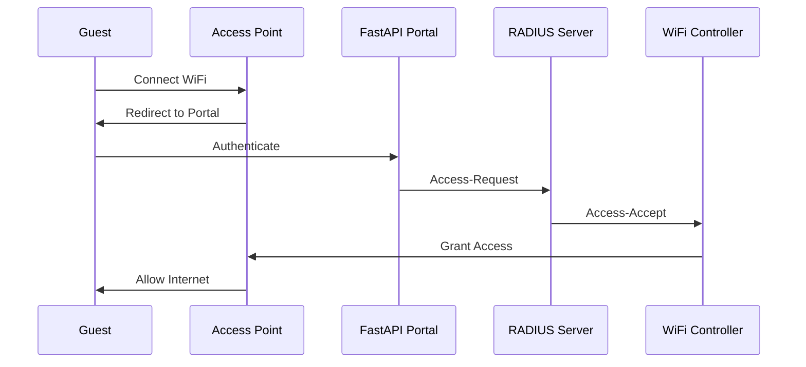

### 5.4 Pattern D: Hybrid Architecture (แนะนำ)

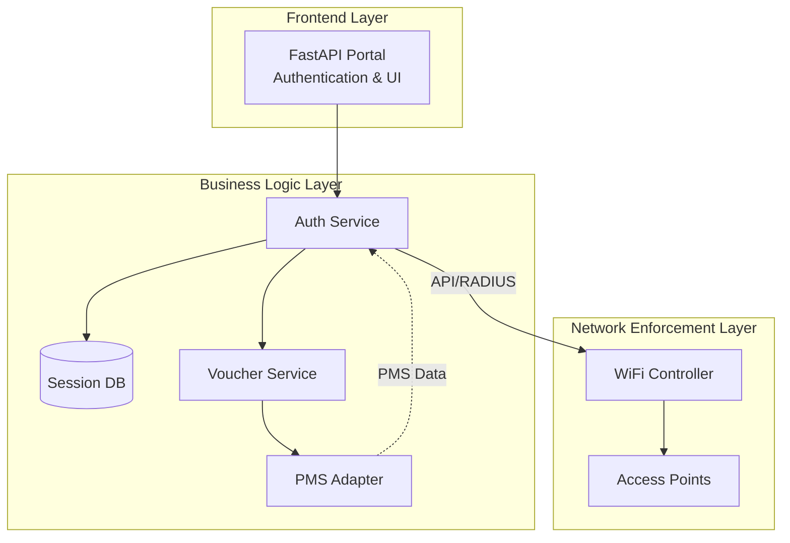

---

## 6. สิ่งที่สามารถย้ายไปยัง WiFi Controller

### 6.1 สามารถแทนที่ได้

| องค์ประกอบปัจจุบัน | การแทนที่ด้วย WiFi Controller |
|-------------------|-------------------------------|
| `tc HTB` bandwidth shaping | Per-client rate limits ผ่าน API |
| `nftables` whitelist sets | Controller's MAC allowlist |
| `nftables` client isolation | Built-in AP-level isolation |
| Session timeout enforcement | Controller session timers |
| `dnsmasq` redirect | Built-in captive portal redirect |
| `dnsmasq` DNS | Controller's integrated DNS |

### 6.2 ควรเก็บไว้ใน FastAPI Portal

| องค์ประกอบ | เหตุผล |
|-----------|--------|
| **Authentication logic (Room/PMS)** | Business logic, PMS integration |
| **Voucher generation** | Custom logic, PDF/QR generation |
| **Session management database** | Data model, reporting |
| **Admin dashboard** | Custom UI for hotel staff |
| **Brand customization** | Hotel-specific branding |
| **Multi-language support** | i18n implementation |
| **Analytics and logging** | Business intelligence |

---

## 7. RADIUS Protocol (ตัวเชื่อมสากล)

### 7.1 RADIUS ทำงานอย่างไรกับ Captive Portal

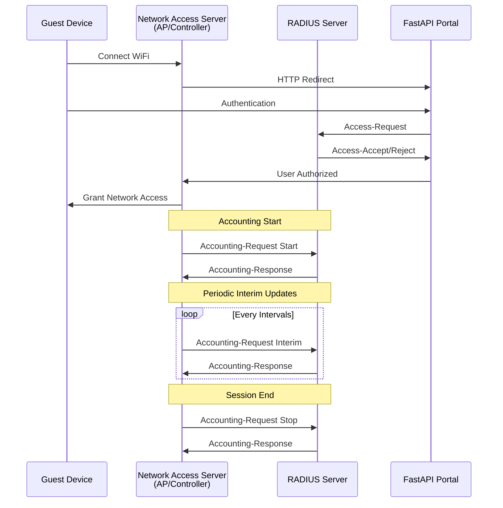

### 7.2 RADIUS Attributes สำหรับ Bandwidth Control

| Attribute | รายละเอียด | ตัวอย่าง |
|-----------|------------|----------|
| `Session-Timeout` | Max session time (วินาที) | 3600 |
| `Acct-Interim-Interval` | Accounting interval | 300 |
| `Bandwidth-Max-Up` | Max upload (bps) | 1000000 |
| `Bandwidth-Max-Down` | Max download (bps) | 5000000 |
| `Filter-Id` | ACL/policy reference | "Guest_Policy" |
| `VLAN` | VLAN assignment | 100 |

---

## 8. ตัวอย่างการ Integration

### 8.1 Cisco Meraki Integration

```python
# app/integrations/meraki.py
import meraki
from typing import Optional

class MerakiWiFiController:
    def __init__(self, api_key: str):
        self.dashboard = meraki.DashboardAPI(api_key)
    
    async def authorize_guest(
        self,
        network_id: str,
        mac_address: str,
        guest_email: str,
        bandwidth_up: int = 1000,  # kbps
        bandwidth_down: int = 5000,  # kbps
        duration_minutes: int = 60
    ) -> dict:
        """Authorize guest after portal authentication"""
        return self.dashboard.wireless.updateNetworkClient(
            networkId=network_id,
            clientMac=mac_address,
            bandwidthLimits={
                'limitUp': bandwidth_up,
                'limitDown': bandwidth_down
            },
            timeout=duration_minutes * 60
        )
    
    async def deauthorize_guest(
        self,
        network_id: str,
        mac_address: str
    ) -> dict:
        """Force disconnect guest"""
        return self.dashboard.wireless.updateNetworkClient(
            networkId=network_id,
            clientMac=mac_address,
            status='disconnected'
        )
```

### 8.2 UniFi Integration

```python
# app/integrations/unifi.py
import requests
from typing import Optional

class UniFiWiFiController:
    def __init__(self, host: str, username: str, password: str):
        self.host = host
        self.base_url = f"https://{host}:8443"
        self.session = requests.Session()
        self._login(username, password)
    
    def _login(self, username: str, password: str):
        """Login to UniFi controller"""
        self.session.post(
            f"{self.base_url}/api/login",
            json={"username": username, "password": password}
        )
    
    async def authorize_guest(
        self,
        site: str,
        mac_address: str,
        minutes: int = 60,
        up: int = 1000,  # kbps
        down: int = 5000  # kbps
    ) -> dict:
        """Authorize guest on UniFi network"""
        return self.session.post(
            f"{self.base_url}/api/s/{site}/cmd/stamgr",
            json={
                "cmd": "authorize-guest",
                "mac": mac_address,
                "minutes": minutes,
                "up": up,
                "down": down
            }
        )
    
    async def deauthorize_guest(
        self,
        site: str,
        mac_address: str
    ) -> dict:
        """Disconnect guest"""
        return self.session.post(
            f"{self.base_url}/api/s/{site}/cmd/stamgr",
            json={
                "cmd": "unauthorizing-guest",
                "mac": mac_address
            }
        )
```

### 8.3 Aruba ClearPass Integration

```python
# app/integrations/aruba_clearpass.py
import requests
from typing import Optional

class ArubaClearPass:
    def __init__(self, hostname: str, client_id: str, client_secret: str):
        self.hostname = hostname
        self.token_url = f"https://{hostname}/api/oauth"
        self.client_id = client_id
        self.client_secret = client_secret
        self._get_token()
    
    def _get_token(self):
        """Get OAuth token"""
        response = requests.post(
            self.token_url,
            data={
                'grant_type': 'client_credentials',
                'client_id': self.client_id,
                'client_secret': self.client_secret
            }
        )
        self.token = response.json()['access_token']
    
    async def authorize_guest(
        self,
        mac_address: str,
        duration_minutes: int,
        bandwidth_profile: str = "Guest_Basic"
    ) -> dict:
        """Create guest account and authorize"""
        headers = {'Authorization': f'Bearer {self.token}'}
        
        # Create sponsor (if needed)
        sponsor = requests.post(
            f"https://{self.hostname}/api/guest",
            headers=headers,
            json={
                "name": f"guest_{mac_address}",
                "email": f"guest_{mac_address}@temp.local"
            }
        )
        
        # Create guest with auth rules
        return requests.post(
            f"https://{self.hostname}/api/authorization",
            headers=headers,
            json={
                "mac_address": mac_address,
                "roles": [bandwidth_profile],
                "validity_time": f"+{duration_minutes}m"
            }
        )
```

---

## 9. ข้อแนะนำสำหรับโปรเจกต์นี้

### 9.1 Phase 1: Hybrid Model (แนะนำ)

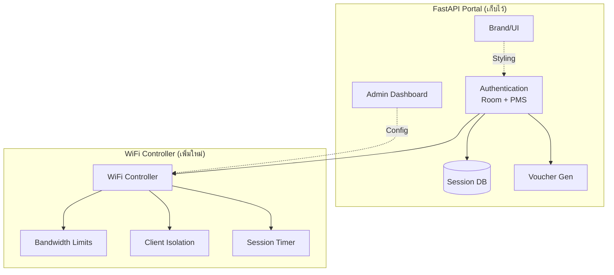

**สิ่งที่เปลี่ยน:**
- `app/network/tc.py` → WiFi Controller API
- `app/network/nftables.py` → WiFi Controller policies
- `app/network/session_manager.py` → Hybrid (DB + Controller API)

**สิ่งที่เก็บ:**
- `app/portal/router.py` - เพิ่ม controller API call หลัง auth
- `app/admin/router.py` - เพิ่ม controller management UI
- ทุก PMS adapter

### 9.2 Phase 2: Full Controller Integration

เมื่อพร้อม เปลี่ยนทั้งหมด:
- Session enforcement → WiFi Controller
- MAC allowlist → Controller's built-in

---

## 10. คำแนะนำการเลือก Vendor

| กรณีใช้งาน | Vendor แนะนำ |
|-----------|--------------|
| **โรงแรมขนาดเล็ก (< 50 ห้อง)** | Ubiquiti UniFi (คุ้มค่า) |
| **โรงแรมขนาดกลาง (50-200 ห้อง)** | Cisco Meraki (cloud-managed, ง่าย) |
| **โรงแรมขนาดใหญ่ (> 200 ห้อง)** | Aruba + ClearPass (enterprise) |
| **รีสอร์ท/คาสิโน (high density)** | RUCKUS (BeamFlex technology) |
| **ชอบ Cloud-native** | Juniper Mist (AI-driven) |
| **มี infrastructure Cisco อยู่แล้ว** | Cisco Meraki/Catalyst |

---

## 11. ข้อดี-ข้อเสียของการย้ายไป WiFi Controller

### 11.1 ข้อดี

| ข้อดี | รายละเอียด |
|-------|------------|
| **ลดความซับซ้อน** | ไม่ต้องดูแล nftables, tc, dnsmasq scripts |
| **Scale ได้ดี** | Controller ออกแบบมาเพื่อ scale |
| **Centralized management** | จัดการทุก AP จากจุดเดียว |
| **ประสิทธิภาพ** | Hardware acceleration สำหรับ traffic |
| **ความน่าเชื่อถือ** | Enterprise-grade reliability |
| **ฟีเจอร์พร้อมใช้** | Captive portal, RADIUS, guest management |

### 11.2 ข้อเสีย

| ข้อเสีย | รายละเอียด |
|---------|------------|
| **ค่าใช้จ่าย** | Hardware + license รายปี |
| **Vendor lock-in** | ผูกกับ ecosystem ของ vendor |
| **Internet dependency** | บาง solutions ต้องการ internet |
| **Learning curve** | ต้องเรียนรู้ API ใหม่ |
| **ความยืดหยุ่นลดลง** | จำกัดด้วยสิ่งที่ controller รองรับ |

---

## 12. ค่าใช้จ่ายและ License

### 12.1 Cisco Meraki

| ประเภทค่าใช้จ่าย | รายละเอียด | ประมาณการ (USD) |
|------------------|------------|-----------------|
| **Hardware AP** | MR46, MR56 | $800 - $2,500/ตัว |
| **Gateway** | MX67, MX68 | $500 - $1,000 |
| **License Enterprise** | ครบวงจร, บังคับต่อปี | $200 - $400/AP/ปี |
| **License Advanced Security** | รวม MDM, AI | $250 - $500/AP/ปี |

**รวมต่อ AP ต่อปี:** ~$300 - $900/AP/ปี

**ข้อสำคัญ:**
- License บังคับซื้อต่อปี (ไม่มี perpetual)
- หากไม่ต่อ license → AP หยุดทำงาน
- มี Co-termination policy (license ครบพร้อมกัน)

---

### 12.2 Aruba (HPE)

| ประเภทค่าใช้จ่าย | รายละเอียด | ประมาณการ (USD) |
|------------------|------------|-----------------|
| **Hardware AP** | Aruba AP-515 | $500 - $1,500/ตัว |
| **Controller** | 7000 Series | $3,000 - $15,000 |
| **Aruba Central (Cloud)** | รายเดือน | $1 - $3/AP/เดือน |
| **ClearPass** | Enterprise AAA, รายปี | $500 - $5,000/ปี |
| **Foundation Care** | Support | 10-20% ของ hardware/ปี |

**รวมต่อ AP ต่อปี:** ~$200 - $600/AP/ปี (รวม Central)

**ข้อสำคัญ:**
- Central ไม่บังคับ (ใช้ controller เองได้)
- ClearPass แยกซื้อ (สำหรับ enterprise AAA)

---

### 12.3 RUCKUS Networks

| ประเภทค่าใช้จ่าย | รายละเอียด | ประมาณการ (USD) |
|------------------|------------|-----------------|
| **Hardware AP** | R650, R750 | $400 - $1,500/ตัว |
| **Unleashed** | Controller-less, license ถาวร | ซื้อครั้งเดียว |
| **RUCKUS One (Cloud)** | รายเดือน | $2 - $5/AP/เดือน |
| **Support** | 24/7 | 10-15% ของ hardware/ปี |

**รวมต่อ AP ต่อปี:** ~$150 - $400/AP/ปี

**ข้อสำคัญ:**
- **Unleashed** = license ถาวร (ซื้อครั้งเดียว ไม่ต่อปี)
- Cloud license รายเดือน → ยืดหยุ่นกว่า

---

### 12.4 Ubiquiti UniFi

| ประเภทค่าใช้จ่าย | รายละเอียด | ประมาณการ (USD) |
|------------------|------------|-----------------|
| **Hardware AP** | U6+, U6-LR | $150 - $300/ตัว |
| **UniFi Dream Machine** | Gateway + AP ในตัว | $299 - $499 |
| **UniFi Network App** | Controller software | **ฟรี** (self-hosted) |
| **Cloud Key** | Controller hardware (optional) | $80 - $300 |
| **Support** | Ubiquiti Pro Support | $500 - $3,000/ปี |

**รวมต่อ AP ต่อปี:** ~$0 - $50/AP/ปี (แทบไม่มีค่า license)

**ข้อสำคัญ:**
- **UniFi Network App = ฟรี** (self-hosted)
- ไม่มี license บังคับ
- Support ไม่บังคับ

---

### 12.5 Juniper Mist

| ประเภทค่าใช้จ่าย | รายละเอียด | ประมาณการ (USD) |
|------------------|------------|-----------------|
| **Hardware AP** | Mist AP61, AP45 | $600 - $2,000/ตัว |
| **Mist Cloud** | Subscription บังคับ | $4 - $8/AP/เดือน |
| **Marvis (AI)** | Virtual Assistant | รวมใน subscription |
| **Premium Analytics** | Advanced reporting | $1 - $2/AP/เดือน เพิ่มเติม |

**รวมต่อ AP ต่อปี:** ~$500 - $1,200/AP/ปี

**ข้อสำคัญ:**
- Subscription บังคับต่อปี
- Cloud-native ไม่มี on-premise option

---

### 12.6 เปรียบเทียบค่าใช้จ่ายรวม (50 APs, 1 ปี)

```mermaid
graph bar
    title["ค่า License/Subscription ต่อปี (50 APs)"]
    
    Meraki : 45000
    Aruba : 30000
    RUCKUS : 20000
    UniFi : 2500
    Mist : 60000
```

| Vendor | Hardware (50 APs) | Year 1 Total | Year 2+ | ต่อปี (50 APs) |
|--------|-------------------|-------------|---------|----------------|
| **Meraki** | $75,000 | ~$125,000 | ~$50,000 | ~$50,000 |
| **Aruba** | $60,000 | ~$80,000 | ~$30,000 | ~$30,000 |
| **RUCKUS** | $50,000 | ~$65,000 | ~$15,000 | ~$15,000 |
| **UniFi** | $15,000 | ~$15,000 | ~$2,500 | ~$2,500 |
| **Mist** | $70,000 | ~$110,000 | ~$48,000 | ~$48,000 |

---

### 12.7 ค่า API Connection (Third-party)

| Vendor | API Connection Fee | หมายเหตุ |
|--------|-------------------|----------|
| **Meraki** | **ฟรี** | API ฟรี, มี official SDK (Python, Go, Node.js) |
| **Aruba** | **ฟรี** | REST API ฟรี |
| **RUCKUS** | **ฟรี** | RUCKUS One API ฟรี |
| **UniFi** | **ฟรี** | UniFi API ฟรี |
| **Mist** | **ฟรี** | Mist API ฟรี |

**สรุป:** ไม่มี vendor ไหนคิดค่า API connection fee โดยตรง

---

### 12.8 สรุปเปรียบเทียบค่า License

```mermaid
graph bar
    title["ค่า License/Subscription ต่อปี (ต่อ AP)"]
    
    Meraki : 600
    Aruba : 400
    RUCKUS : 275
    UniFi : 25
    Mist : 850
```

| Vendor | ค่า License/ปี (ต่อ AP) | รูปแบบ | ข้อสังเกต |
|--------|------------------------|--------|------------|
| **Meraki** | $300 - $900 | บังคับต่อปี | ไม่ต่อ = AP หยุดทำงาน |
| **Aruba** | $200 - $600 | Subscription บังคับ | Central ไม่บังคับ |
| **RUCKUS** | $150 - $400 | ถาวร หรือ Subscription | Unleashed = ถาวร |
| **UniFi** | $0 - $50 | ไม่บังคับ | Network App ฟรี |
| **Mist** | $500 - $1,200 | บังคับต่อปี | Cloud-native |

---

### 12.9 ข้อสำคัญในการเลือกตาม Budget

| Budget | แนะนำ | เหตุผล |
|--------|--------|--------|
| **ต่ำ (< $5,000/ปี)** | Ubiquiti UniFi | แทบไม่มีค่า license |
| **ปานกลาง ($15,000-30,000/ปี)** | RUCKUS Unleashed | License ถาวร, คุ้มค่าระยะยาว |
| **สูง (> $50,000/ปี)** | Meraki หรือ Aruba | Enterprise features, cloud-managed |

---

## 13. สรุปแนวทาง

### แนวทางที่ 1: เก็บ Linux Infrastructure ไว้ (Current)
```
Guest → nftables → tc HTB → dnsmasq → Internet
         ↑
    FastAPI Portal
```
**เหมาะกับ:** ทีมที่มี Linux expertise, budget จำกัด

### แนวทางที่ 2: Hybrid (แนะนำ)
```
Guest → WiFi Controller (enforcement)
         ↑
    FastAPI Portal (auth & business logic)
```
**เหมาะกับ:** ต้องการ enterprise features แต่ยังคงควบคุม auth ได้

### แนวทางที่ 3: Full Controller
```
Guest → WiFi Controller (ทุกอย่าง)
```
**เหมาะกับ:** ใช้ captive portal มาตรฐานของ vendor

---

## 14. ขั้นตอนถัดไป

1. **ประเมินโรงแรม/ลูกค้าเป้าหมาย** - ดูว่ามี WiFi infrastructure อยู่แล้วหรือไม่
2. **เลือก vendor** - ตามข้อแนะนำใน section 10 + budget ใน section 12
3. **Proof of Concept** - ทดสอบกับ Meraki หรือ UniFi ก่อน
4. **ออกแบบ adapter pattern** - สร้าง abstract interface สำหรับ controller หลายตัว
5. **Implement Phase 1** - เริ่มจาก bandwidth control ก่อน
6. **Iterate** - ขยายไป features อื่นๆ

---

## 15. เอกสารอ้างอิง

- [Cisco Meraki Captive Portal API Documentation](https://developer.cisco.com/meraki/)
- [Aruba ClearPass API Documentation](https://developer.arubanetworks.com/)
- [UniFi Controller API Documentation](https://ubnt.com/developers)
- [RUCKUS One API Documentation](https://developer.ruckuscloud.com/)
- [Juniper Mist API Documentation](https://developer.mist.com/)
- [RADIUS Protocol RFC 2865](https://tools.ietf.org/html/rfc2865)
- [Captive Portal RFC 8910](https://tools.ietf.org/html/rfc8910)

---

## 16. ภาคผนวก: Mermaid Diagrams Source


---

**จัดทำโดย:** AI Agent  
**วันที่:** 26 มีนาคม 2569
