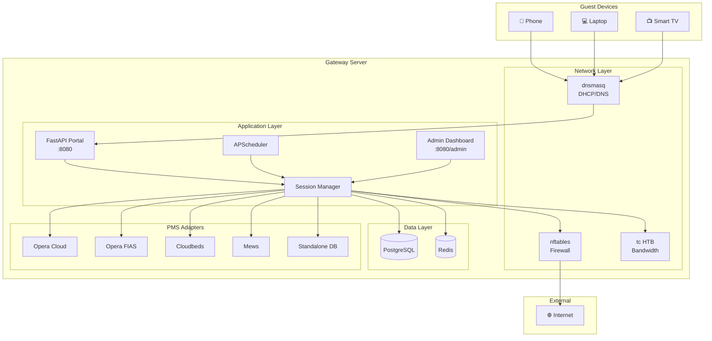
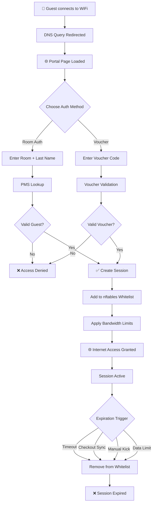
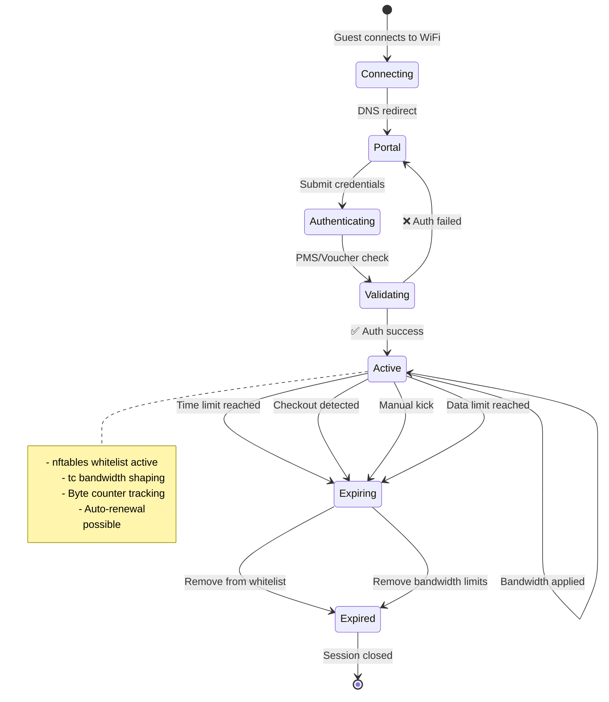
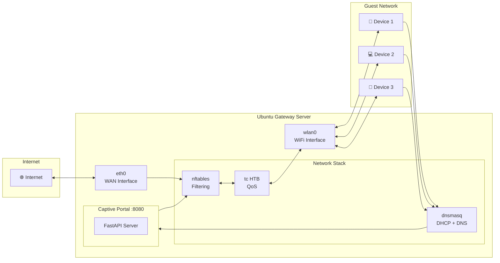
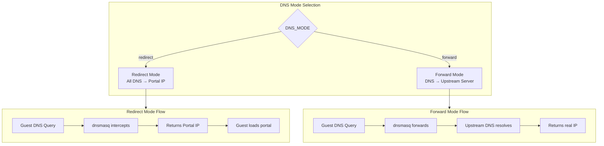
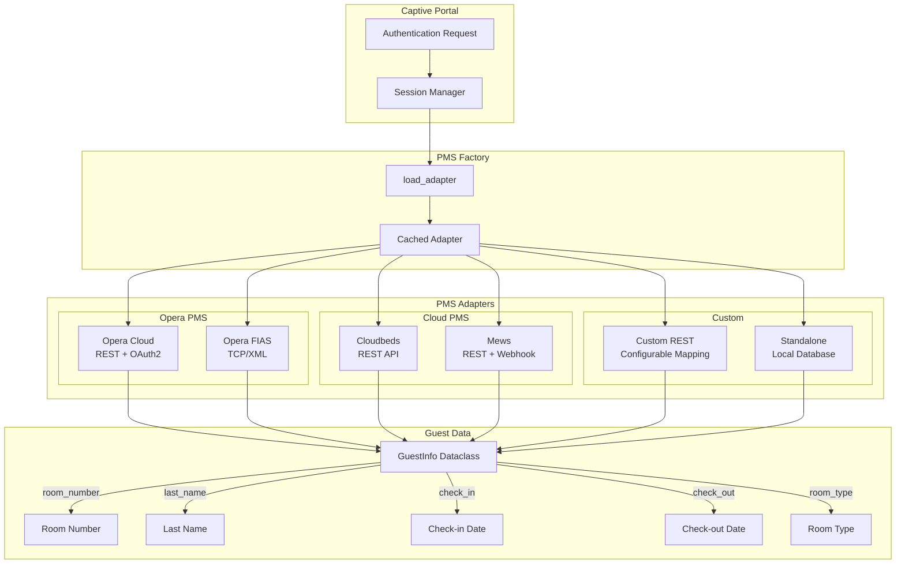
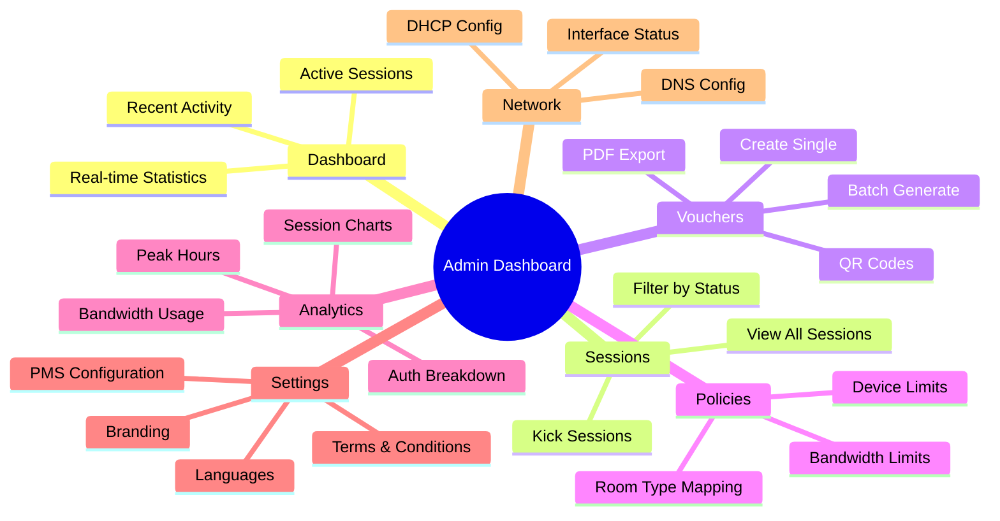
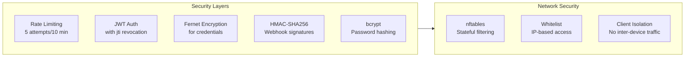

# 🏨 WiFi Captive Portal

[](https://www.python.org/)
[](https://fastapi.tiangolo.com/)
[](LICENSE)
[](https://www.postgresql.org/)

A production-ready **Hotel WiFi Captive Portal** system with enterprise-grade features, PMS integrations, bandwidth management, and a modern admin dashboard.

---

## ✨ Key Features

- 🔐 **Multiple Authentication Methods** - Room + Last Name, Voucher Codes
- 🏨 **PMS Integrations** - Opera Cloud, Opera FIAS, Cloudbeds, Mews, Custom REST
- 📊 **Bandwidth Management** - Traffic Control (tc) with HTB shaping
- 🛡️ **Modern Firewall** - nftables with O(1) set lookups and flowtables
- 📱 **Responsive Admin Dashboard** - Real-time analytics, session management
- 🎫 **Voucher System** - PDF generation with QR codes
- 🌐 **Multi-language Support** - Thai/English localization
- 🔧 **GUI Installer** - PyQt6 desktop installer for easy deployment

---

## 📋 Table of Contents

- [System Architecture](#-system-architecture)
- [Authentication Flow](#-authentication-flow)
- [Session Lifecycle](#-session-lifecycle)
- [Network Topology](#-network-topology)
- [Quick Start](#-quick-start)
- [Installation](#-installation)
- [Configuration](#-configuration)
- [Technology Stack](#-technology-stack)
- [Documentation](#-documentation)
- [Contributing](#-contributing)
- [License](#-license)

---

## 🏗 System Architecture



---

## 🔐 Authentication Flow



---

## 🔄 Session Lifecycle



---

## 🌐 Network Topology



---

## 🚀 Quick Start

### Prerequisites

- Ubuntu 22.04 LTS or 24.04 LTS
- Python 3.12+
- PostgreSQL 14+
- Redis 6+
- Two network interfaces (WiFi + WAN)

### Option 1: GUI Installer (Recommended)

```bash
# Clone the repository
git clone https://github.com/your-org/wifi-captive-portal.git
cd wifi-captive-portal

# Run the GUI installer
python installer/main.py
```

The PyQt6 installer provides:
- ✅ System validation
- ✅ Dependency installation
- ✅ Database setup
- ✅ Service configuration
- ✅ Automatic rollback on failure

### Option 2: Command Line

```bash
# Clone and enter directory
git clone https://github.com/your-org/wifi-captive-portal.git
cd wifi-captive-portal

# Run installation script
sudo bash scripts/install.sh

# Configure environment
cp .env.example .env
nano .env

# Start the service
sudo systemctl start captive-portal
```

---

## 📁 Project Structure

```
wifi-captive-portal/
├── app/
│   ├── core/              # Config, database, auth, models
│   ├── network/           # nftables, tc, session management
│   ├── pms/               # PMS adapters (Opera, Cloudbeds, Mews)
│   ├── voucher/           # Voucher generation & validation
│   ├── portal/            # Guest-facing routes & templates
│   ├── admin/             # Admin dashboard routes & templates
│   └── main.py            # FastAPI entry point
├── docs/                  # Documentation
├── scripts/               # Installation & setup scripts
├── installer/             # PyQt6 GUI installer
├── static/                # CSS, JS, images
├── tests/                 # Test suite
├── alembic/               # Database migrations
├── .env.example           # Environment template
└── requirements.txt       # Python dependencies
```

---

## ⚙️ Configuration

### Environment Variables

Create a `.env` file from the template:

```bash
cp .env.example .env
```

| Variable | Description | Default |
|----------|-------------|---------|
| `SECRET_KEY` | JWT signing key (≥32 chars) | - |
| `ENCRYPTION_KEY` | Fernet key for credentials | - |
| `DATABASE_URL` | PostgreSQL connection string | - |
| `REDIS_URL` | Redis connection string | `redis://localhost:6379/0` |
| `WIFI_INTERFACE` | WiFi interface name | `wlan0` |
| `WAN_INTERFACE` | WAN interface name | `eth0` |
| `PORTAL_IP` | Portal IP address | `10.0.0.1` |
| `PORTAL_PORT` | Portal port | `8080` |

### Network Modes



---

## 🏨 PMS Integration



### Supported PMS Systems

| PMS | Protocol | Webhook | Polling |
|-----|----------|---------|---------|
| Opera Cloud | REST/OAuth2 | ✅ | - |
| Opera FIAS | TCP/XML | - | ✅ |
| Cloudbeds | REST API | - | ✅ |
| Mews | REST API | ✅ | - |
| Custom REST | Configurable | ✅ | ✅ |
| Standalone | Local DB | - | - |

---

## 📊 Admin Dashboard

The admin dashboard provides comprehensive management:



---

## 🧪 Development

### Setup Development Environment

```bash
# Create virtual environment
python -m venv .venv
source .venv/bin/activate

# Install dependencies
pip install -r requirements.txt
pip install -r requirements-dev.txt

# Run database migrations
alembic upgrade head

# Start development server
uvicorn app.main:app --reload --host 0.0.0.0 --port 8080
```

### Running Tests

```bash
# Run all tests
pytest tests/ -v

# Run with coverage
pytest tests/ --cov=app --cov-report=term-missing

# Run single test
pytest tests/test_portal/test_portal_routes.py::test_room_auth_success -v
```

---

## 🛡️ Security Features



---

## 📚 Documentation

| Document | Description |
|----------|-------------|
| [Features](docs/features.md) | Complete feature documentation |
| [Installation Guide](docs/installation-guide.md) | Step-by-step installation |
| [User Manual](docs/user-manual.md) | Guest & Admin user guide |
| [GUI Installer Guide](docs/gui-installer-guide.md) | Desktop installer usage |
| [CLAUDE.md](CLAUDE.md) | Development guidance |

---

## 🤝 Contributing

1. Fork the repository
2. Create a feature branch (`git checkout -b feature/amazing-feature`)
3. Commit your changes (`git commit -m 'Add amazing feature'`)
4. Push to the branch (`git push origin feature/amazing-feature`)
5. Open a Pull Request

---

## 📄 License

This project is licensed under the MIT License - see the [LICENSE](LICENSE) file for details.

---

## 🙏 Acknowledgments

- [FastAPI](https://fastapi.tiangolo.com/) - Modern Python web framework
- [nftables](https://netfilter.org/projects/nftables/) - Linux packet filtering
- [HTMX](https://htmx.org/) - Modern HTML-first frontend
- [Tailwind CSS](https://tailwindcss.com/) - Utility-first CSS framework

---

<p align="center">
  <strong>Made with ❤️ for the hospitality industry</strong>
</p>
